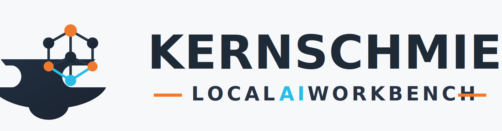

# Kernschmiede



[](https://github.com/Thomas-Heisig/python-chat-system/actions/workflows/ci.yml)
[](https://github.com/Thomas-Heisig/python-chat-system/actions/workflows/codeql.yml)
[](https://github.com/Thomas-Heisig/python-chat-system/actions/workflows/dependency-review.yml)
[](https://github.com/Thomas-Heisig/python-chat-system/actions/workflows/release.yml)
[](https://github.com/Thomas-Heisig/python-chat-system/actions/workflows/stale.yml)

Kernschmiede ist ein modulares, lokal betreibbares Chat-System mit FastAPI, React, Modellverwaltung und Training-Workbench.

## Scope

Das Projekt befindet sich in aktiver Entwicklung. Unterstuetzt werden primar:

- aktueller Stand von `main`
- neueste veroeffentlichte Version
- dokumentierte Setup-Wege aus dieser README

## Highlights

- FastAPI-Backend mit asynchronen API-Routen
- React-Frontend mit Vite und TypeScript
- Streaming-Chatantworten
- Modellscan und Modellaktivierung (lokale Verzeichnisse)
- GGUF-/Transformers-Workflows je nach Backend
- Training-Workbench mit Datensatz- und Job-Management
- Sicherheits- und Qualitaetschecks via GitHub Actions

## Quickstart

### 1) Voraussetzungen

- Python 3.12
- Node.js 22.x
- npm
- Git

Optional fuer GPU/Training:

- CUDA-faehige NVIDIA-GPU
- passende Treiber und CUDA-kompatibles PyTorch

### 2) Repository klonen

```bash
git clone https://github.com/Thomas-Heisig/python-chat-system.git
cd python-chat-system
```

### 3) Backend vorbereiten

Linux/macOS:

```bash
python3.12 -m venv .venv-chat
source .venv-chat/bin/activate
python -m pip install --upgrade pip
pip install -r requirements-dev.txt
```

Windows PowerShell:

```powershell
py -3.12 -m venv .venv-chat
.\.venv-chat\Scripts\Activate.ps1
python -m pip install --upgrade pip
pip install -r requirements-dev.txt
```

### 4) Frontend vorbereiten

```bash
cd frontend
npm ci
cd ..
```

### 5) Konfiguration anlegen

Linux/macOS:

```bash
cp .env.example .env
```

Windows PowerShell:

```powershell
Copy-Item .env.example .env
```

Wichtig: `SECRET_KEY` in `.env` ersetzen und `.env` nie committen.

## Starten

Nur Backend:

```bash
python start.py --reload
```

Backend + Frontend:

Windows:

```powershell
.\scripts\start_fullstack.ps1
```

Linux/macOS:

```bash
./scripts/start_fullstack.sh
```

## Wichtige Projektdateien

- [README](README.md)
- [Support Guide](.github/SUPPORT.md)
- [Security Policy](.github/SECURITY.md)
- [Contributing](.github/CONTRIBUTING.md)
- [Code of Conduct](.github/CODE_OF_CONDUCT.md)
- [Roadmap](docs/ROADMAP.md)
- [Todo](docs/todo.md)
- [Changelog](docs/changelog.md)

## Sicherheit

Sicherheitsmeldungen nicht oeffentlich als Issue posten.

- Privater Meldeweg: [Security Advisories](https://github.com/Thomas-Heisig/python-chat-system/security/advisories/new)
- Verbindliche Richtlinie: [.github/SECURITY.md](.github/SECURITY.md)

## Support

Fuer Fehler, Bedienungsfragen, Funktionswuensche und Dokumentationsprobleme:

- [Issues](https://github.com/Thomas-Heisig/python-chat-system/issues)
- Richtlinie: [.github/SUPPORT.md](.github/SUPPORT.md)

## Lizenz

Dieses Projekt steht unter der Apache License 2.0.

Siehe [LICENSE](LICENSE).
