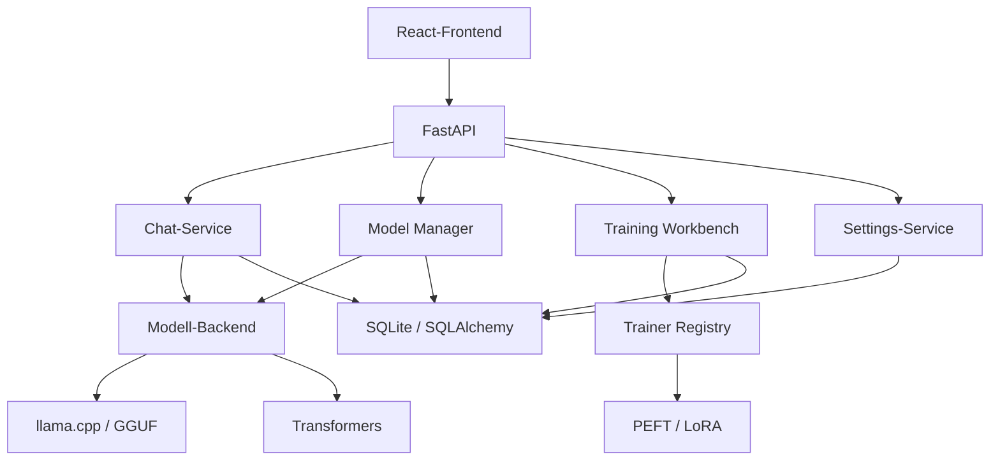
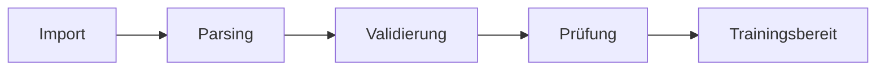
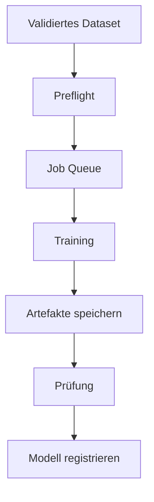

Ich würde die README stärker auf den tatsächlichen Nutzen, den aktuellen Entwicklungsstand, Installation, Sicherheit und Grenzen ausrichten. Wichtig ist insbesondere die klare Trennung zwischen bereits implementierten Funktionen und geplanten Funktionen.

Die Badges für „Release Drafter“ und „Stale“ würde ich entfernen. Sie sagen wenig über die technische Qualität aus. CI, CodeQL und Dependency Review sind dagegen sinnvoll.

Nachfolgend eine vollständig überarbeitete Fassung:

````markdown
# Python Chat System

[](https://github.com/Thomas-Heisig/python-chat-system/actions/workflows/ci.yml)
[](https://github.com/Thomas-Heisig/python-chat-system/actions/workflows/codeql.yml)
[](https://github.com/Thomas-Heisig/python-chat-system/actions/workflows/dependency-review.yml)

Modulares, lokal betreibbares Chatsystem mit FastAPI, React und austauschbaren KI-Modell-Backends.

Das Projekt verbindet Chatbetrieb, Modellverwaltung, zentrale Einstellungen und eine Training Workbench in einer gemeinsamen Anwendung. Der derzeitige Schwerpunkt liegt auf lokalen Modellen, GGUF-Ausführung, LoRA-Training und einem kontrollierten Betrieb auf Windows- und Linux-Systemen.

> Das Projekt befindet sich in aktiver Entwicklung. Es ist derzeit nicht als ungeprüfte, öffentlich erreichbare Produktionsanwendung vorgesehen.

## Inhalt

- [Funktionsumfang](#funktionsumfang)
- [Architektur](#architektur)
- [Technologien](#technologien)
- [Systemvoraussetzungen](#systemvoraussetzungen)
- [Schnellstart](#schnellstart)
- [Konfiguration](#konfiguration)
- [Netzwerkzugriff](#netzwerkzugriff)
- [Modellverwaltung](#modellverwaltung)
- [Training Workbench](#training-workbench)
- [Sicherheit](#sicherheit)
- [Tests und Qualitätsprüfung](#tests-und-qualitätsprüfung)
- [Projektstruktur](#projektstruktur)
- [Dokumentation](#dokumentation)
- [Entwicklungsstand](#entwicklungsstand)
- [Mitwirkung und Support](#mitwirkung-und-support)
- [Lizenz](#lizenz)

## Funktionsumfang

### Chat und API

- FastAPI-Backend mit asynchroner Verarbeitung
- React-Frontend mit Vite
- Streaming-Ausgabe für Chatantworten
- persistente Unterhaltungen und Nachrichten
- einheitliche Schnittstelle für unterschiedliche Modell-Backends
- Health- und Diagnose-Endpunkte
- Begrenzung gleichzeitig aktiver Generierungen
- Warteschlange für parallele Anfragen

### Modellverwaltung

- Scan konfigurierbarer lokaler Modellverzeichnisse
- Erkennung von GGUF- und Transformer-Modellen
- zentrale Modellregistrierung
- Aktivierung und Wechsel lokaler Modelle
- Rollback-Logik bei fehlgeschlagener Modellaktivierung
- GPU-First-Ausführung mit CPU-Fallback
- konfigurierbare Grenzen für VRAM und Arbeitsspeicher

### Einstellungen und Administration

- persistente Einstellungen in der Datenbank
- priorisierte Einstellungsauflösung
- TTL-Cache für häufig verwendete Einstellungen
- Laufzeitkonfiguration für Modelle, Chat und Training
- CORS- und Netzwerk-Konfiguration über Umgebungsvariablen

### Training Workbench

- Import und Verwaltung von Trainingsdatensätzen
- kanonische Trainingsdatensätze
- Dataset-Validierung und Preflight-Prüfung
- Trainingsjobs mit Queue und Fortschrittsdaten
- Referenz- und reale Trainingsläufe
- PEFT/LoRA-Training
- optionales 4-Bit-Laden mit bitsandbytes
- Modellregistrierung nach erfolgreichem Training
- Unterscheidung zwischen simulierten und realen Trainingsläufen

## Architektur



Die Anwendung ist in API-, Service-, Repository- und Modellschichten gegliedert. Chatbetrieb, Modellverwaltung und Training verwenden getrennte Fachbereiche, greifen aber auf gemeinsame Einstellungen und Datenbankkomponenten zu.

## Technologien

### Backend

- Python 3.12
- FastAPI
- Uvicorn
- SQLAlchemy 2
- SQLite mit aiosqlite
- Pydantic
- llama-cpp-python
- Transformers
- PEFT
- TRL
- PyTorch
- bitsandbytes

### Frontend

- React 19
- TypeScript
- Vite
- TanStack Query
- react-markdown
- Vitest
- Testing Library

### Qualität und Sicherheit

- pytest
- pytest-asyncio
- Ruff
- Vitest
- GitHub Actions
- CodeQL
- Dependency Review
- Dependabot

## Systemvoraussetzungen

### Erforderlich

- Python 3.12
- Git
- Node.js 22.13 oder neuer innerhalb der unterstützten Node-22-Versionen
- npm
- ausreichend freier Speicher für Modelle und Trainingsartefakte

### Optional

- NVIDIA-GPU mit CUDA-Unterstützung
- llama.cpp-kompatibles GGUF-Modell
- Hugging-Face-kompatibles Transformer-Modell
- CUDA-kompatible PyTorch-Installation
- bitsandbytes für 4-Bit-Training

Die konkrete GPU- und CUDA-Kompatibilität hängt von PyTorch, llama-cpp-python, bitsandbytes, Betriebssystem und Grafikkartentreiber ab.

## Schnellstart

### 1. Repository klonen

```bash
git clone https://github.com/Thomas-Heisig/python-chat-system.git
cd python-chat-system
```

### 2. Umgebungsdatei anlegen

Linux/macOS:

```bash
cp .env.example .env
```

Windows PowerShell:

```powershell
Copy-Item .env.example .env
```

Vor dem ersten Start sollte mindestens `SECRET_KEY` in der `.env` geändert werden.

### 3. Python-Umgebung erstellen

Linux/macOS:

```bash
python3.12 -m venv .venv-chat
source .venv-chat/bin/activate
python -m pip install --upgrade pip
pip install -r requirements.txt
```

Windows PowerShell:

```powershell
py -3.12 -m venv .venv-chat
.\.venv-chat\Scripts\Activate.ps1
python -m pip install --upgrade pip
pip install -r requirements.txt
```

### 4. Frontend-Abhängigkeiten installieren

```bash
cd frontend
npm ci
cd ..
```

### 5. Anwendung starten

Backend und Frontend gemeinsam:

Windows:

```powershell
.\scripts\start_fullstack.ps1
```

Linux/macOS:

```bash
./scripts/start_fullstack.sh
```

Anschließend ist das Frontend standardmäßig erreichbar unter:

```text
http://localhost:5173
```

Das Backend verwendet standardmäßig:

```text
http://localhost:8000
```

Die interaktive FastAPI-Dokumentation ist im Entwicklungsbetrieb in der Regel erreichbar unter:

```text
http://localhost:8000/docs
```

## Alternative Startmöglichkeiten

### Nur Backend starten

```bash
python start.py --reload
```

### Eigene Bind-Adresse und eigenen Port verwenden

```bash
python start.py --host 127.0.0.1 --port 8000
```

### Datenbank und Standardwerte initialisieren

```bash
python start.py --init-only
```

### Initialisierung ohne Modellscan

```bash
python start.py --init-only --skip-model-scan
```

### Laufende Instanzen vor dem Start beenden

Windows:

```powershell
.\scripts\start_fullstack.ps1 -StopExisting
```

Linux/macOS:

```bash
STOP_EXISTING=1 ./scripts/start_fullstack.sh
```

Die Startskripte ermitteln den Projektpfad unabhängig vom aktuellen Arbeitsverzeichnis. Bereits belegte Ports und laufende Instanzen werden geprüft, bevor neue Prozesse gestartet werden.

## Empfohlene Python-Umgebung

Für Chat und Training wird eine gemeinsame virtuelle Umgebung mit Python 3.12 empfohlen:

```text
.venv-chat
```

Die Startskripte suchen Python-Umgebungen in dieser Reihenfolge:

1. `.venv-chat`
2. `.venv-training`
3. `.venv`
4. global installierter Python-Interpreter

Windows-Setup-Helfer:

```powershell
.\scripts\setup_venv_chat.ps1 `
  -TargetPython "C:\Pfad\zu\Python312\python.exe" `
  -InstallCoreDeps
```

## Konfiguration

Die wichtigsten Umgebungsvariablen befinden sich in `.env.example`.

| Variable | Zweck | Beispiel |
|---|---|---|
| `APP_ENV` | Laufzeitumgebung | `development` |
| `APP_NAME` | Anwendungsname | `python-chat-system` |
| `DATABASE_URL` | Datenbankverbindung | `sqlite+aiosqlite:///./data/database/chat_system.db` |
| `SECRET_KEY` | geheimer Anwendungsschlüssel | eigener zufälliger Wert |
| `SETTINGS_CACHE_TTL_SECONDS` | Gültigkeit des Settings-Caches | `5` |
| `MAX_ACTIVE_GENERATIONS` | gleichzeitig aktive Generierungen | `1` |
| `MAX_QUEUE_LENGTH` | maximale Länge der Anfragewarteschlange | `16` |
| `GPU_MEMORY_LIMIT_MB` | konfiguriertes VRAM-Limit | `11000` |
| `RAM_MEMORY_LIMIT_MB` | konfiguriertes RAM-Limit | `24000` |
| `CORS_ALLOW_ORIGINS` | erlaubte Frontend-Origins | `http://localhost:5173` |
| `CORS_ALLOW_ORIGIN_REGEX` | optionales Origin-Muster | leer |
| `CORS_ALLOW_CREDENTIALS` | CORS-Credentials erlauben | `true` |
| `FRONTEND_HOST` | Bind-Adresse des Frontends | `0.0.0.0` |
| `FRONTEND_PORT` | Port des Frontends | `5173` |
| `VITE_DEV_BACKEND_TARGET` | Backend-Ziel des Vite-Proxys | `http://127.0.0.1:8000` |
| `VITE_API_BASE_URL` | explizite API-Basis-URL | leer |
| `VITE_ALLOWED_HOSTS` | optionale Vite-Host-Allowlist | leer |

### Sicherheitshinweis zum Secret

Die Vorgabe aus `.env.example` darf nicht produktiv verwendet werden:

```text
SECRET_KEY=change-this-key
```

Beispiel zur Erzeugung eines zufälligen Schlüssels:

```bash
python -c "import secrets; print(secrets.token_urlsafe(48))"
```

## Netzwerkzugriff

`start.py` und die Fullstack-Skripte binden standardmäßig an `0.0.0.0`. Dadurch kann die Anwendung abhängig von Firewall und Netzwerk auch von anderen Geräten erreicht werden.

### Lokal

```text
http://localhost:5173
```

### Lokales Netzwerk

```text
http://<LAN-IP>:5173
```

### Internet

Ein öffentlicher Betrieb sollte nur hinter einem korrekt konfigurierten Reverse Proxy erfolgen, beispielsweise mit:

- TLS/HTTPS
- enger CORS-Allowlist
- sicherer Authentifizierung
- Firewall-Regeln
- Request-Größenbegrenzung
- Rate Limiting
- regelmäßigen Sicherheitsupdates
- getrennten Entwicklungs- und Produktionsgeheimnissen

Der Vite-Entwicklungsserver ist kein Ersatz für einen gehärteten Produktions-Webserver.

## Modellverwaltung

Beim Start können lokale Modellverzeichnisse gescannt werden. Die Verzeichnisse werden über das Setting `model.base_directories` verwaltet.

Beispiele:

```text
./model-directories
F:\KI\models
```

Es werden nur freigegebene lokale, absolute Modellpfade akzeptiert. URL-Schemata, NUL-Bytes und Pfade außerhalb der erlaubten Basisverzeichnisse werden abgewiesen.

### GPU-First-Verhalten

Das Standardverhalten wird über folgendes Setting gesteuert:

```text
model.prefer_gpu = true
```

Bei der Modellaktivierung wird zunächst die GPU-Ausführung versucht. Wenn das gewählte Backend einen CPU-Fallback unterstützt, kann anschließend auf CPU zurückgefallen werden.

Ein CPU-Fallback bedeutet nicht, dass jedes Modell mit ausreichender Geschwindigkeit oder innerhalb des verfügbaren Arbeitsspeichers ausgeführt werden kann.

## Training Workbench

Die Training Workbench erweitert das Chatsystem um Dataset-, Trainings- und Registrierungsabläufe.

### Dataset-Ablauf



Rohdokumente und Webseiten sind nicht automatisch hochwertige Trainingsdaten. Import, Parsing, Validierung und Trainingsfreigabe sollten deshalb getrennt behandelt werden.

### Trainingsablauf



### Derzeit vorhandene Trainer

- `reference`
- `peft_lora`
- `unsloth_lora`

Die tatsächliche Verfügbarkeit eines Trainers hängt von Betriebssystem, Python-Umgebung, CUDA, GPU, Modellformat und installierten Zusatzabhängigkeiten ab.

### Preflight-Prüfung

Vor einem Trainingsstart werden unter anderem geprüft:

- Modellregistrierung
- Modellpfad und Modellformat
- Tokenizer und Modellarchitektur
- Dataset-Struktur
- Artefaktverzeichnis
- freier Speicherplatz
- CUDA-Verfügbarkeit
- Voraussetzungen für 4-Bit-Laden
- Freigabe von CPU-Training

Weitere Einzelheiten enthält die Datei [`docs/training-workbench.md`](docs/training-workbench.md).

## Sicherheit

Das Projekt enthält unter anderem Schutzmaßnahmen für:

- SSRF bei URL-basierten Dataset-Importen
- private, lokale und reservierte Netzwerkadressen
- eingebettete Zugangsdaten in URLs
- erneute Prüfung von Redirect-Zielen
- Path Traversal und unzulässige Modellpfade
- redigierte Fehlerantworten
- PBKDF2-basierte Passwort-Hashes
- reduzierte Ausgabe sensibler Modellinformationen
- parserbasierte HTML-Textextraktion
- automatisierte CodeQL- und Dependency-Prüfungen

### Bekannte Einschränkung bei älteren Passwörtern

Zur Kompatibilität mit alten lokalen Datenbeständen existiert derzeit noch ein Klartext-Legacy-Fallback für Passwortwerte ohne Hashformat. Dieser sollte nur als Übergangslösung betrachtet und durch eine kontrollierte Migration bestehender Konten entfernt werden.

### Sicherheitsmeldungen

Sicherheitsprobleme bitte nicht als öffentliches Issue melden. Das vorgesehene Meldeverfahren ist in [`.github/SECURITY.md`](.github/SECURITY.md) beschrieben.

## Tests und Qualitätsprüfung

### Backend-Tests

```bash
pip install -r requirements-dev.txt
pytest
```

### Python-Linting

```bash
ruff check .
```

### Frontend-Tests

```bash
cd frontend
npm ci
npm run test:run
```

### Frontend-Build

```bash
cd frontend
npm run build
```

### Abhängigkeitsprüfung

```bash
cd frontend
npm audit
```

CI, CodeQL und Dependency Review werden zusätzlich über GitHub Actions ausgeführt.

Ein grüner Build belegt, dass die jeweils konfigurierten Prüfungen erfolgreich waren. Er ersetzt keine vollständige Sicherheitsprüfung oder manuelle Funktionsprüfung.

## Projektstruktur

```text
python-chat-system/
├── app/
│   ├── api/                 # allgemeine API-Routen
│   ├── chat/                # Chat-Domäne und Services
│   ├── core/                # gemeinsame Kernfunktionen
│   ├── models/              # Modellverwaltung und Pfadsicherheit
│   ├── settings/            # persistente Einstellungen
│   └── training/            # Datasets, Jobs, Trainer und Evaluation
├── frontend/                # React-/TypeScript-Frontend
├── scripts/                 # Setup-, Start- und Hilfsskripte
├── docs/                    # Architektur, Roadmap und Changelog
├── tests/                   # Backend-Tests
├── .github/                 # Workflows und Community-Dateien
├── .env.example             # Beispielkonfiguration
├── requirements.txt         # Python-Laufzeitabhängigkeiten
├── requirements-dev.txt     # Test- und Entwicklungsabhängigkeiten
└── start.py                 # Initialisierung und Backend-Start
```

Die genaue Struktur kann sich während der aktiven Entwicklung ändern.

## Dokumentation

- [Training-Workbench-Architektur](docs/training-workbench.md)
- [Changelog](docs/changelog.md)
- [Roadmap](docs/ROADMAP.md)
- [Offene Aufgaben](docs/todo.md)
- [Beitragsrichtlinien](.github/CONTRIBUTING.md)
- [Sicherheitsrichtlinie](.github/SECURITY.md)
- [Support](.github/SUPPORT.md)
- [Verhaltenskodex](.github/CODE_OF_CONDUCT.md)

## Entwicklungsstand

| Bereich | Stand |
|---|---|
| FastAPI-Grundsystem | implementiert |
| React-Frontend | implementiert |
| SQLite-Persistenz | implementiert |
| GGUF-/llama.cpp-Backend | implementiert |
| Modellscan und Modellwechsel | implementiert |
| Streaming-Chat | implementiert |
| persistente Einstellungen | implementiert |
| Dataset-Import und Validierung | implementiert, weiterer Ausbau vorgesehen |
| Trainingsjob-Queue | implementiert |
| PEFT-/LoRA-Training | implementiert, umgebungsabhängig |
| Trainingsevaluation | teilweise implementiert beziehungsweise im Ausbau |
| PostgreSQL | geplant |
| pgvector und Hybrid Retrieval | geplant |
| verteilte Worker | geplant |
| produktionsreife Bereitstellung | noch nicht abgeschlossen |

## Geplante Weiterentwicklung

- Datenbankmigrationen mit Alembic
- PostgreSQL-Unterstützung
- pgvector
- Embeddings und Hybrid Retrieval
- granularer Trainings-Lifecycle
- erweiterte Evaluation und Benchmarks
- Regressionstests für sicherheitsrelevante Pfade
- verteilte Worker
- zentralisierte und getestete Fehlerbereinigung
- gehärtete Produktionsbereitstellung

Maßgeblich für die Planung sind [`docs/ROADMAP.md`](docs/ROADMAP.md) und [`docs/todo.md`](docs/todo.md).

## Mitwirkung und Support

Vor größeren Änderungen sollten bestehende Issues, Roadmap und Architekturentscheidungen geprüft werden.

- Beiträge: [`.github/CONTRIBUTING.md`](.github/CONTRIBUTING.md)
- Fehlerberichte: [GitHub Issues](https://github.com/Thomas-Heisig/python-chat-system/issues)
- Support: [`.github/SUPPORT.md`](.github/SUPPORT.md)
- Sicherheitsprobleme: [`.github/SECURITY.md`](.github/SECURITY.md)

## Lizenz

Derzeit ist im Repository keine Lizenzdatei hinterlegt.

Ohne ausdrückliche Lizenz bleiben die urheberrechtlichen Nutzungsrechte grundsätzlich beim Rechteinhaber. Vor einer externen Weitergabe oder der Annahme fremder Beiträge sollte daher eine passende Lizenz ausgewählt und als `LICENSE` hinterlegt werden.
````

Wesentliche Verbesserungen gegenüber der bisherigen README:

* Funktionen und Planungen werden getrennt dargestellt.
* Die Training Workbench wird erstmals sichtbar erklärt.
* Installation umfasst Backend und Frontend vollständig.
* Sicherheits- und Produktionshinweise wurden ergänzt.
* Der private Pfad `F:\symple chat` wurde aus dem allgemeinen Schnellstart entfernt.
* Python 3.12 und Node 22 werden konsistent angegeben.
* Die fehlende Lizenz wird ausdrücklich benannt.
* Der noch vorhandene Klartext-Passwort-Fallback wird nicht verschwiegen.
* Marketing-Badges ohne technischen Aussagewert wurden entfernt.
* Architektur, Trainingsablauf und Projektstatus sind übersichtlicher dargestellt.
